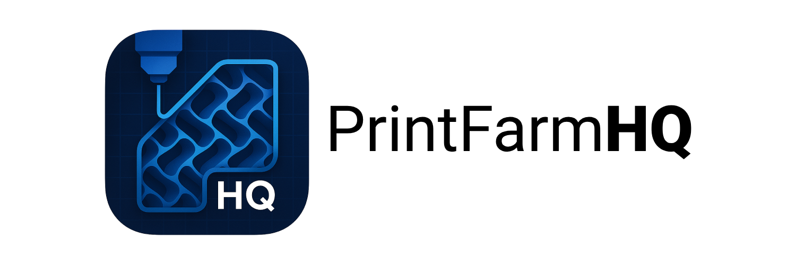

# 🏭 PrintFarmHQ

> 🚀 Transform your 3D printing business with intelligent inventory management and cost tracking

## 🎯 What is PrintFarmHQ?

PrintFarmHQ helps 3D printing businesses **save time and money** by automating the tedious parts of running a print farm:

### 📦 Smart Inventory Tracking
Never run out of filament mid-print again. Track stock levels across multiple materials.

### 💰 True Cost Calculator
Know your *real* profit margins. We calculate material costs, printer depreciation, and time automatically.

### 🎨 Multi-Material Support
Building complex products? Track which filaments each product needs and ensure you have everything in stock.

### 📁 3D Model Library
Upload STL/3MF files and link them to products. Keep your designs organized and accessible.

### 🖨️ Fleet Management
Track multiple printers, their usage hours, and maintenance schedules. Know which machines are profitable.

---

## ⚡ Prerequisites

You'll need:
- 🐳 Docker & Docker Compose
- 🛠️ Make (usually pre-installed on Mac/Linux)  
- 💾 ~2GB free disk space

## 🚀 Fast Installation

```bash
git clone https://github.com/yourusername/printfarmhq.git
cd printfarmhq
make up
```

**✅ That's it!** PrintFarmHQ is now running at http://localhost:3000

On first visit, you'll be guided through creating your admin account.

> **💡 Version Note:** `make up` runs the latest stable release. For development use `make dev` or `VERSION=latest make up`

---

## 🎮 Try It Out (5 minutes)

Now that PrintFarmHQ is running, here's what to try first:

### 1️⃣ Add Your First Filament
- Go to **Filaments** tab
- Click "Add Filament" 
- Add something like: PLA, Black, Brand: PETG+

### 2️⃣ Create a Printer Profile
- Go to **Printers** tab
- Add your printer model with purchase price and expected life hours
- This helps calculate accurate depreciation costs

### 3️⃣ Create a Product
- Go to **Products** tab  
- Upload an STL file and set print time
- Link it to your filament 
- **Watch the magic**: PrintFarmHQ automatically calculates your **cost of production** including materials, printer depreciation, and time

### 4️⃣ Create a Print Job
- Go to **Prints** tab
- Create a new print job using your product
- Select quantity and printer
- **See your COGS**: The system shows the complete **Cost of Goods Sold** for your final product

### 5️⃣ Understand Your True Costs
- Review the detailed cost breakdown: materials, printer wear, labor time
- This is your **real** cost per print - not just material costs!
- Use this data to set profitable pricing

---

## 🎛️ Essential Commands

```bash
make up        # Start PrintFarmHQ
make down      # Stop PrintFarmHQ
make logs      # View application logs
```

---

## 🔧 Customize Your Setup

### 🔐 Admin Account
On first run, you'll be prompted to create your admin account through the web interface.
No environment variables or manual configuration required!

---

## 🚢 Deploy to Production

### ✅ Security Checklist

Before going live:

1. **🔑 Change all default credentials** in `backend/.env`
2. **🔒 Use a secure JWT secret** (done automatically by `make install`)
3. **🌐 Configure CORS** in backend code for your domain
4. **🔐 Use HTTPS** for all connections
5. **💾 Set up database backups** with `make dump-db`

**📖 Full security guide**: [docs/SECURITY.md](docs/SECURITY.md)

### 🗄️ Database Operations

```bash
make dump-db      # Backup database
make restore-db   # Restore from backup
```

⚠️ Consider switching from SQLite to PostgreSQL for production use.

---

## 🤝 Contributing

We love contributions! Whether it's:
- 🐛 Bug reports
- 💡 Feature ideas
- 📝 Documentation improvements
- 🔧 Code contributions

Check out our [GitHub Issues](https://github.com/yourusername/printfarmhq/issues) to get started.

---

## 📄 License

PrintFarmHQ uses **dual licensing**:

- **🌍 Open Source**: AGPL-3.0 for community use
- **🏢 Commercial**: Available for businesses who need proprietary modifications

For commercial licensing: **info@reltech.io**

See [LICENSE](LICENSE) for details.

---

## 🐳 Docker Images

PrintFarmHQ uses pre-built Docker images that work on both **Intel/AMD (x86)** and **Apple Silicon (ARM)** processors:

```bash
# Pull latest images (automatic architecture detection)
docker compose pull

# Or use specific images directly
docker pull ghcr.io/printfarmhq/printfarmhq-backend:latest
docker pull ghcr.io/printfarmhq/printfarmhq-frontend:latest
```

### Building Custom Images

```bash
# Build for your current architecture
make docker-build

# Build with custom namespace (e.g., your GitHub username)
NAMESPACE=yourusername make docker-build

# Build and push for multiple architectures
NAMESPACE=yourusername make docker-push-multiarch
```

All images are hosted on GitHub Container Registry for fast, reliable access.

## 🧪 Testing

We have a comprehensive suite of automated tests, mainly focusing on functional and e2e tests, both for the backend and the frontend:

```bash
# Run all tests (backend + frontend)
make test

# Run specific test suites
make test-backend    # Backend tests only
make test-frontend   # Frontend E2E tests only
```

All test commands automatically clean up artifacts after running. To see all available commands for testing, refer to README.

## 💬 Get Help

- **📚 Documentation**: [/docs](docs/)
- **🐛 Issues**: [GitHub Issues](https://github.com/yourusername/printfarmhq/issues)
- **💼 Commercial Support**: info@reltech.io

---

<div align="center">
  
  Built with ❤️ for the 3D printing community
  
  ⭐ **Star us on GitHub!**
  
</div>
