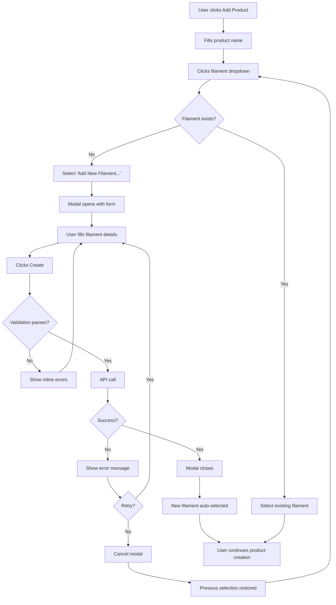

# UI/UX Flow and User Journey

## Overview

Detailed documentation of the user experience flow for inline filament creation, including all interaction points, feedback mechanisms, and edge cases.

## User Journey Map

### Primary Flow: Creating Product with New Filament



## Detailed Interaction Steps

### 1. Initial State - Filament Selection

**Visual State:**
```
┌─────────────────────────────┐
│ Filament *                  │
│ ┌─────────────────────────┐ │
│ │ Select filament      ▼  │ │
│ └─────────────────────────┘ │
└─────────────────────────────┘
```

**Interaction:**
- User clicks on dropdown
- Dropdown opens showing available filaments

### 2. Dropdown Open State

**Visual State:**
```
┌─────────────────────────────┐
│ Filament *                  │
│ ┌─────────────────────────┐ │
│ │ Select filament      ▼  │ │
│ └─────────────────────────┘ │
│ ┌─────────────────────────┐ │
│ │ 🔴 Red PLA             │ │
│ │ ⚫ Black PETG          │ │
│ │ 🔵 Blue ABS            │ │
│ │ ─────────────────────  │ │
│ │ ➕ Add New Filament... │ │
│ └─────────────────────────┘ │
└─────────────────────────────┘
```

**Features:**
- Color indicators for each filament
- Material type visible
- Separator before "Add New" option
- "Add New" option styled differently (primary color, icon)

### 3. Modal Opening

**Transition:**
- Fade in overlay (200ms)
- Scale up modal (200ms)
- Focus moves to first input

**Visual State:**
```
┌────────────────────────────────────────┐
│          Add New Filament              │
│ ────────────────────────────────────── │
│ Create a new filament type for your    │
│ product. You can optionally add it to  │
│ inventory tracking.                    │
│                                        │
│ Color *                                │
│ ┌──────────────────────┐ ┌──┐         │
│ │                      │ │🎨│         │
│ └──────────────────────┘ └──┘         │
│                                        │
│ Brand *                                │
│ ┌────────────────────────────┐         │
│ │                            │         │
│ └────────────────────────────┘         │
│                                        │
│ Material *                             │
│ ┌────────────────────────────┐         │
│ │ PLA                    ▼   │         │
│ └────────────────────────────┘         │
│                                        │
│ Average Cost per kg (€) *              │
│ ┌────────────────────────────┐         │
│ │ 25.00                      │         │
│ └────────────────────────────┘         │
│ ℹ️ Used for cost calculations          │
│                                        │
│ ☐ Add to inventory tracking           │
│   Track actual inventory for this      │
│   filament                             │
│                                        │
│ [Cancel]          [Create Filament]    │
└────────────────────────────────────────┘
```

### 4. Color Selection Experience

**Color Picker Interaction:**
```
┌────────────────────────────────────────┐
│ Color *                                │
│ ┌──────────────────────┐ ┌──┐         │
│ │ Black                │ │🎨│ ◄─ Click│
│ └──────────────────────┘ └──┘         │
│ ┌────────────────────────────┐         │
│ │ ⚫ ⚪ 🔴 🔵 🟢          │ ◄─ Opens│
│ │ 🟡 🟠 🟣 🔘 ⬜          │         │
│ │ Black White Red Blue Green │         │
│ └────────────────────────────┘         │
└────────────────────────────────────────┘
```

**Features:**
- Quick color presets
- Visual color swatches
- Text input for custom colors
- Click preset to auto-fill

### 5. Brand Autocomplete

**Typing Experience:**
```
┌────────────────────────────────────────┐
│ Brand *                                │
│ ┌────────────────────────────┐         │
│ │ Pru█                       │         │
│ └────────────────────────────┘         │
│ ┌────────────────────────────┐         │
│ │ Prusament                  │ ◄─ Suggestions
│ │ Prusa                      │         │
│ └────────────────────────────┘         │
└────────────────────────────────────────┘
```

### 6. Inventory Tracking Expanded

**When "Add to inventory tracking" is checked:**
```
┌────────────────────────────────────────┐
│ ☑ Add to inventory tracking           │
│                                        │
│ ⚠️ Low Inventory Warning               │
│ Without inventory tracking, remember   │
│ to order before production.            │
│                                        │
│ ┌─ Initial Inventory Details ────────┐ │
│ │                                    │ │
│ │ Initial Quantity (kg) *            │ │
│ │ ┌─────────────┐  Purchase Price *  │ │
│ │ │ 1.0         │  ┌──────────────┐  │ │
│ │ └─────────────┘  │ 25.00        │  │ │
│ │                  └──────────────┘  │ │
│ │                                    │ │
│ │ Purchase Date     Channel          │ │
│ │ ┌─────────────┐  ┌──────────────┐  │ │
│ │ │ 2024-01-15  │  │ Amazon       │  │ │
│ │ └─────────────┘  └──────────────┘  │ │
│ │                                    │ │
│ │ Notes                              │ │
│ │ ┌──────────────────────────────┐   │ │
│ │ │ First batch, good quality    │   │ │
│ │ └──────────────────────────────┘   │ │
│ └────────────────────────────────────┘ │
│                                        │
│ [Cancel]          [Create Filament]    │
└────────────────────────────────────────┘
```

### 7. Form Validation

**Real-time Validation:**
```
┌────────────────────────────────────────┐
│ Quantity (kg) *                        │
│ ┌────────────────────────────┐         │
│ │ -1                         │ ❌      │
│ └────────────────────────────┘         │
│ Quantity must be greater than 0        │
└────────────────────────────────────────┘
```

**Features:**
- Inline error messages
- Red border on invalid fields
- Error icon
- Clear error text

### 7. Submission States

**Loading State:**
```
┌────────────────────────────────────────┐
│ [Cancel]    [⟳ Creating...         ]   │
└────────────────────────────────────────┘
```

**Success State:**
- Modal fades out
- Success toast appears
- Filament is selected in dropdown
- Focus returns to next form field

### 8. Error Handling

**Duplicate Filament:**
```
┌────────────────────────────────────────┐
│ ⚠️ Filament Already Exists             │
│                                        │
│ Black PLA by Prusament is already in  │
│ your inventory.                        │
│                                        │
│ [Use Existing]          [Cancel]       │
└────────────────────────────────────────┘
```

**Network Error:**
```
┌────────────────────────────────────────┐
│ ❌ Connection Error                     │
│                                        │
│ Unable to connect to server. Please    │
│ check your connection and try again.   │
│                                        │
│ [Retry]                 [Cancel]       │
└────────────────────────────────────────┘
```

## Micro-interactions

### 1. Hover States
- Dropdown items: Light background highlight
- "Add New" option: Darker highlight, cursor pointer
- Buttons: Subtle shadow, slight scale

### 2. Focus States
- Clear focus rings on all interactive elements
- Tab order: logical flow through form
- Skip to "Add New" with keyboard search

### 3. Loading Feedback
- Button shows spinner
- Form inputs disabled
- Subtle pulse animation on modal

### 4. Success Feedback
- Green checkmark animation
- Toast notification slides in
- Smooth transition back to form

## Inventory Warning Scenarios

### 1. Product Form Warning
When selecting a filament with no inventory:
```
┌─────────────────────────────────────────┐
│ Plate 1: Base Plate                     │
├─────────────────────────────────────────┤
│ Filament                                │
│ ┌─────────────────────────────────────┐ │
│ │ Cosmic Blue PLA (Generic)       ▼   │ │
│ └─────────────────────────────────────┘ │
│                                         │
│ ⚠️ No inventory tracked for this        │
│    filament                             │
│                                         │
│ Grams Used *                            │
│ ┌─────────────────────────────────────┐ │
│ │ 150                                  │ │
│ └─────────────────────────────────────┘ │
└─────────────────────────────────────────┘
```

### 2. Product Save Confirmation
When saving a product with no-inventory filaments:
```
┌─────────────────────────────────────────┐
│        Review Before Saving             │
├─────────────────────────────────────────┤
│                                         │
│ ⚠️ Inventory Warning                     │
│                                         │
│ This product uses filaments with no     │
│ tracked inventory:                      │
│                                         │
│ • Cosmic Blue PLA (Generic)             │
│ • Glow Green PETG (NoName)              │
│                                         │
│ Make sure to order these filaments      │
│ before starting production.             │
│                                         │
│ [Go Back]          [Save Anyway]        │
└─────────────────────────────────────────┘
```

## Edge Cases and Special Flows

### 1. No Existing Filaments
```
┌─────────────────────────────┐
│ Filament *                  │
│ ┌─────────────────────────┐ │
│ │ No filaments available  │ │
│ │ ➕ Add your first      │ │
│ └─────────────────────────┘ │
└─────────────────────────────┘
```

### 2. Search in Dropdown
User can type to filter:
- "bl" → Shows "Black PLA", "Blue PETG"
- "pet" → Shows all PETG filaments
- No match → Shows "Add New Filament..."

### 3. Multiple Filament Additions
- Each addition updates dropdown immediately
- Previously added filaments appear at top
- Recent indicator for newly added

### 4. Keyboard Navigation
- `Tab`: Navigate form fields
- `Enter`: Submit form (when valid)
- `Escape`: Close modal, restore previous
- `Arrow keys`: Navigate dropdown options
- `/`: Focus search in dropdown

## Mobile Responsive Design

### Phone (< 640px)
- Modal takes full screen
- Larger touch targets (48px minimum)
- Color presets in 4-column grid
- Stacked quantity/price fields

### Tablet (640px - 1024px)
- Modal centered with margin
- Original layout preserved
- Touch-optimized spacing

## Accessibility Features

### 1. Screen Reader Announcements
```html
<!-- When modal opens -->
<div role="status" aria-live="polite">
  Add new filament dialog opened. 
  Fill in the required fields to create a new filament.
</div>

<!-- On success -->
<div role="status" aria-live="polite">
  Filament created successfully. 
  Black PLA has been selected for your product.
</div>
```

### 2. ARIA Labels
- Form fields with descriptive labels
- Required fields marked with aria-required
- Error messages linked with aria-describedby

### 3. Keyboard Shortcuts
- `Ctrl/Cmd + Enter`: Submit form
- `Escape`: Cancel and close
- `Tab`: Navigate forward
- `Shift + Tab`: Navigate backward

## Performance Considerations

### 1. Lazy Loading
- Modal component loaded on demand
- Color picker loaded when needed

### 2. Optimistic Updates
- Show new filament immediately
- Rollback on error
- Smooth perceived performance

### 3. Debouncing
- Brand autocomplete debounced (300ms)
- Validation debounced (500ms)
- Prevent excessive API calls

## Success Metrics

1. **Time to Complete**: < 30 seconds from open to close
2. **Error Rate**: < 5% of attempts
3. **Abandonment Rate**: < 10% of opens
4. **Successful Selection**: > 95% select created filament
5. **User Satisfaction**: Reduced friction in workflow